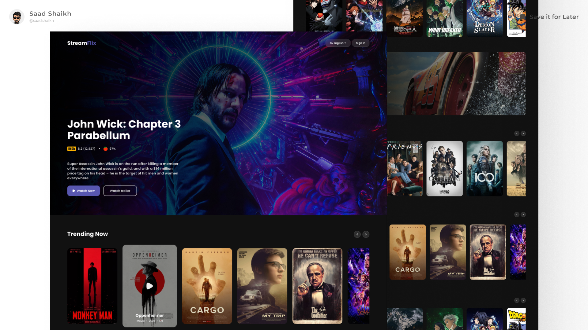

# StreamFlix



**StreamFlix** is a modern, responsive streaming platform UI that showcases trending movies, anime, exclusive shows, and more. Built with **React** and **Tailwind CSS**, it delivers a sleek, interactive experience inspired by leading streaming services.

---

## 🚀 Live Preview

- **[Live Preview](https://stream-flixxx.vercel.app/)**
  <br>Experience StreamFlix in action.

## 🎨 Figma UI Inspiration

- **[Figma Design File](https://www.figma.com/community/file/1309781252222655669/movie-streaming-site)**
  <br>View or duplicate the original Figma design.

---

## ✨ Features

- **Home Page**: Eye-catching hero section with movie highlights and ratings.
- **Movies Page**:
  - Browse by Trending, Latest Releases, Exclusive Shows, Most Popular, and Top Rated
  - Horizontal scrollable carousels for each category
  - Interactive media cards with hover/focus effects and play icons
- **FAQs Section**: Expandable/collapsible answers to common questions.
- **Footer**: Company info, quick links, and copyright.
- **Responsive Design**: Optimized for desktop and mobile.
- **Modern UI**: Custom fonts, Hugeicons, and smooth transitions for a professional look.

---

## 🛠️ Technologies Used

- **HTML**
- **CSS**
- **JavaScript**
- **React**
- **Tailwind CSS**

---

## ⚡ Installation

To run this project locally:

1. **Clone the repository:**
    ```bash
    git clone https://github.com/saad-shaikh-256/stream-flix.git
    ```

2. **Navigate to the project folder:**
    ```bash
    cd stream-flix
    ```

3. **Install dependencies:**
    ```bash
    npm install
    ```

4. **Start the development server:**
    ```bash
    npm start
    ```

5. **Open [http://localhost:3000](http://localhost:3000) in your browser.**

6. *(Optional)* To watch Tailwind CSS changes:
    ```bash
    npm run dev
    ```

---

## 📝 Notes

- This project is **frontend-only** and does not include backend functionality such as authentication, user profiles, or media streaming.
- You can extend this project by adding features such as **user authentication**, **watchlists**, **movie detail pages**, or **backend integration** with services like Firebase or Node.js.
- If you find any issues or have suggestions, feel free to contribute or report them in the GitHub repository.

---

## 🚧 Future Enhancements

- User authentication and profiles
- Watchlist and favorites
- Movie/series detail pages
- Search and filter functionality
- Dark mode toggle

---

## 🙌 Credits

- **UI Design Inspiration:** [Figma Community File](https://www.figma.com/community/file/1309781252222655669/movie-streaming-site)
- **Designed & Developed by [Saad Shaikh](https://saad-shaikh.vercel.app/)**

---

Feel free to suggest features, report bugs, or fork the project!
